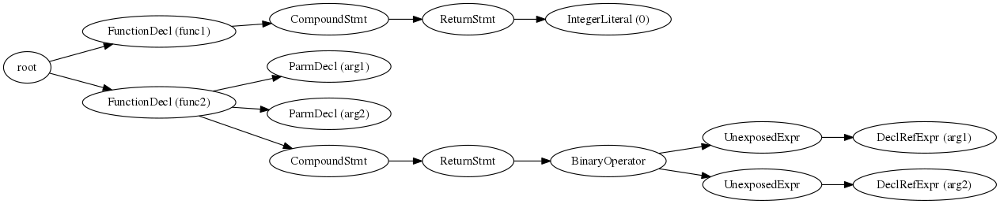
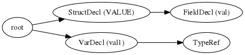
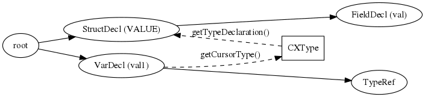

libclang の AST(Abstract Syntax Tree)
=====
Author: ifritJP

<h2>Table of Contents</h2>

<ul>
<li><a href="#sec-1">1. libclang とは</a></li>
<li><a href="#sec-2">2. libclang の CXCursor</a>
<ul>
<li><a href="#sec-2-1">2.1. CXCursor とは</a></li>
<li><a href="#sec-2-2">2.2. 木構造</a></li>
<li><a href="#sec-2-3">2.3. CXCursor からアクセス可能な情報</a></li>
<li><a href="#sec-2-4">2.4. 型情報 CXType</a></li>
</ul>
</li>
<li><a href="#sec-3">3. 動かしてみよう</a></li>
</ul>

<!---*- coding:utf-8 -*--->

# libclang とは

libclang は clang の機能にアクセスするためのライブラリです。

libclang を利用することで C/C++ のソースコード解析などが出来ます。

# libclang の CXCursor

libclang で C/C++ のソースコードを解析すると、
そのソースコードの AST (Abstract Syntax Tree) にアクセスできます。

この AST には CXCursor 構造体を通してアクセスします。
AST にアクセスすることで、解析対象のソースコードにどのような関数が定義されていて、
その関数内でどのような変数にアクセスしているかや、
どのような関数をコールしているか、などを簡単に調べることができます。

## CXCursor とは

CXCursor は、 libclang で clang の AST にアクセスするための構造体です。

clang 内部では AST を C++ のクラスで管理していますが、
ライブラリのインタフェースではクラスを直接扱えないため、
CXCursor 構造体でラッピングしています。

    アプリ -> CXCursor (C) -> libclang (C/C++)-> AST (C++)

## 木構造

AST (Abstract Syntax Tree)は、その名の通り木構造になっています。

例えば次のようなソースを解析すると、

    int func1( void ) {
      return 0;
    }
    int func2( int arg1, int arg2 ) {
      return arg1 + arg2;
    }

次のような情報が AST の木構造に格納されます。

上記の root は木構造の先頭を意味し、root から各ノードを辿ることで、
解析したソースの構造を把握することができます。

statement, expression, literal 等でノードが生成されます。

このノードが CXCursor そのものです。

## CXCursor からアクセス可能な情報

CXCursor を libclang が提供する関数に与えることで、
さまざまな情報を取得することが可能です。

例えば、上記 AST の各ノードの種別(FunctionDecl, CompoundStmt, ReturnStmt 等)は、
CXCursor:getCursorKind() で取得します。

CXCursor から取得可能な代表的な情報を挙げます。
- CursorKind (種別)
    - CXCursor:getCursorKind()
- 文字列 (FunctionDecl であればその関数名)
    - CXCursor:getCursorSpelling()
- CXType (型情報)
    - CXCursor:getCursorType()
- ソース上の位置
    - CXCursor:getCursorLocation()
- DeclRefExpr などの参照元 CXCursor
    - CXCursor:getCursorReferenced()
- ハッシュ
    - CXCursor:hashCursor()

## 型情報 CXType

CXCursor から、そのノードの型情報(CXType)を取得できます。

例えば引数宣言 ParmDecl の型情報は、宣言している引数の型を示します。

具体的には int arg1 の型情報 CXType は、 int を示す情報となります。

なお、C 言語の変数にポインタや配列があるように、
型情報 CXType はそれらポインタや配列の情報を含みます。

例えば int \* pVal の型情報 CXType は、 int \* を示す情報となり、
これは int val の型情報 CXType とは異なります。

C 言語の変数は int 等の primitive な型だけでなく、構造体等の型を持つこともできます。
その場合、CXType は構造体の型を示すことになります。

    struct VALUE {
      int val;
    };
    struct VALUE val1;

例えば上記 val1 の型は構造体 VALUE です。
このとき AST は次のようになります。

ここで VarDecl の CXType は、構造体 VALUE を示します。

VarDecl の CXType が具体的にどのような型であるかは、
次のように処理するとこで得られます。
- CXType:getTypeDeclaration() を使ってその型を宣言している CXCursor を取得
- その CXCursor 情報を確認する

上記サンプルの場合、 CXType:getTypeDeclaration() で得られる CXCursor は、
VALUE の StructDecl となります。

CXCursor はハッシュ値を持っています。
CXCursor が同一かどうかは、ハッシュ値で比較するか
CXCursor:equalCursors() 関数で確認出来ます。

# 動かしてみよう

CXCursor と CXType の関係さえ分かれば、
後は実際に libclang を使って AST を生成し、
AST の中身を見てみるのが一番理解が早いと思います。

その際 [libclanglua](https://github.com/ifritJP/libclanglua) が役に立てれば嬉しいです。